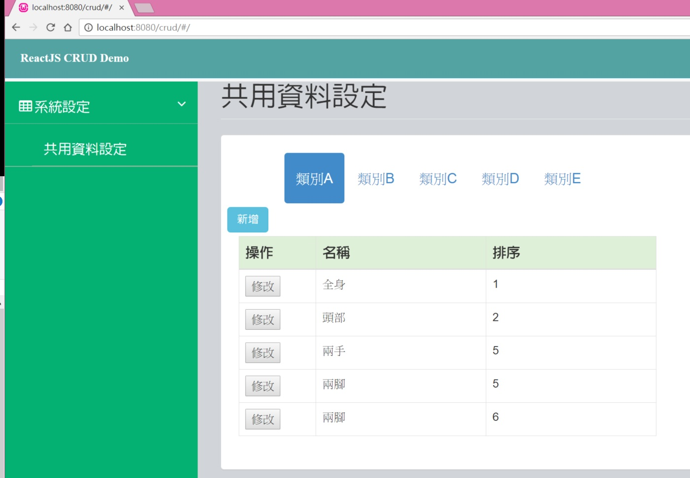
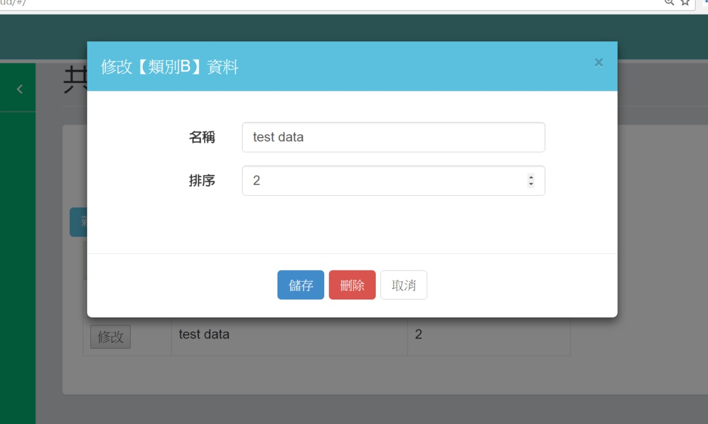

## 專案說明

使用ReactJS+Redux製作一具有新增、刪除修改功能的資料管理介面 

## 開頭小話

取之於網路，用之於網路，自從發現了ReactJS這玩意兒就放下手上玩一半的AngularJS，然後再發現了Redux，積累了幾個月一直茫茫渺渺，看看範例看看blog神人的演出其實都是看表演而已，就一個念頭，既然這玩具這麼好用，一定要搞一個可以ShowModal方式以AJAX的方式來做一個新增刪除修改功能的頁面，既然小小的搞出來一個版本，回饋給網路上也在學習的朋友，希望能有些幫助，當然，做得不夠好，還請多多指教。

## 特色

1. 可設定不同類別，可於同一個畫面維護管理所有類別資料。
2. 新增、刪除與修改都在同一個畫面可以完成。
3. 邊學邊用使用了Redux。

## Server API部分

1. 使用了Codeigniter 3，你可以改用你習慣的。
2. 使用 [codeigniter-restserver](https://github.com/chriskacerguis/codeigniter-restserver)這個專案的API Controller，新增用POST、修改用PUT、查詢用GET以及刪除用DELETE，相信對於全端高手們這只是一片蛋糕，詳細的整合使用請參考前述來源。
3. 在 app/constants/bootstrap.js裡面api_url設定了API來源，使用CI開發的controller位置在 PHP_CI_Controller/kv.php，提供參考。
4. 資料庫使用了MYSQL，這個範例對應的table的sql script如下

```
CREATE TABLE `kv` (
  `id` int(11) NOT NULL,
  `gp` varchar(20) NOT NULL,
  `k` varchar(20) DEFAULT NULL,
  `v` varchar(20) DEFAULT NULL,
  `vtype` varchar(10) DEFAULT NULL,
  `sort` int(11) NOT NULL DEFAULT '0'
) ENGINE=InnoDB DEFAULT CHARSET=utf8;

```

## 使用的theme

本來想用Bootstrap刻，很直接的用google搜尋free Bootstrap admin theme找到這頁順眼的 https://colorlib.com/wp/free-bootstrap-admin-dashboard-templates/，使用了裡面的siminta。

## 如何測試這個範例

* 使用了webpack
* 先fork回去或是直接clone
* `npm install`
* `npm run build`

## 執行畫面





刪除前還會提示確認唷 !

